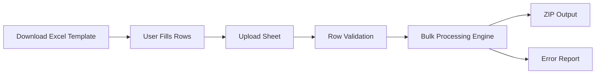
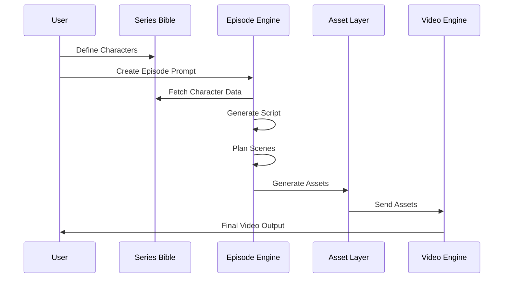

# GenAI Assignment:

**Evaluation Criteria**

We will score your submission on:

* Clarity and practicality of architecture
* Robust JSON schema design
* Prompt quality (zero-shot, reliable, minimal hallucination risk)
* Handling of ambiguity + user review flow
* Bulk generation thinking (errors, naming, report)

## Problem 1: **Proposal for “Video-to-Notes”**

We have a local folder of long videos (3–4 hours each, 200MB+). Watching them fully is slow. We need an automated way to generate a “summary package” per video: **Summary.md** + highlight clips + screenshots, all organized per video. [READ MORE ABOUT THE PROJECT](./Video-summary-platform.md)

### **Task**

Prepare a **pre-processed solution proposal** comparing  **three approaches** **:**

1. **Online/Cloud-Based (Already Available Solutions)**
2. **Build Our Own Using LLM APIs (Hybrid: local media processing + cloud LLM)**
3. **Build Fully Offline Using Open-Source Models (Local transcription + local LLM + pipeline)**

No code required. We want a **clear, practical proposal** with architecture and tradeoffs.

### Your Solution for problem 1:


# Automated Long-Video Summary System Proposal

## 1. Problem Statement

We have a local folder containing long videos (3–4 hours each, 200MB+ per file). Watching them end-to-end to extract useful insights is time-consuming and does not scale.

We need a fully automated batch system that processes every video in a folder and generates a structured, concise “summary package” that can be consumed in 5–10 minutes.

For each input video, the system must generate:

- `Summary.md` (structured Markdown)
- Highlight clips aligned with timestamps
- Screenshots tied to highlights
- Predictable per-video folder structure

---

## 2. Required Output Structure

```

input/videos/
video_name1.mp4
video_name2.mp4

output/
video_name1/
Summary.md
clips/
screenshots/
video_name2/
Summary.md
clips/
screenshots/

```

---

## 3. System Requirements

- Must handle large files (200MB+)
- Must process long-duration videos (3–4 hours)
- Must run in batch mode (no manual work per video)
- Highlights must contain accurate timestamps
- Generated clips and screenshots must match timestamps exactly
- Summary must be readable in 5–10 minutes
- Output must be structured and predictable

---

# Approach 1: Online / Cloud-Based Solution

## Architecture

```

Local Folder
↓
Upload to Cloud Storage
↓
Cloud Transcription API
↓
Cloud LLM Summarization + Highlight Detection
↓
Timestamp Extraction (JSON Output)
↓
Local FFmpeg Processing
↓
Generate Summary.md + Assets

````

## Strengths

- Very high transcription accuracy
- Built-in diarization and segmentation
- Easy scaling
- Production-ready infrastructure

## Weaknesses

- Higher cost for long videos
- Upload time for large files
- Data privacy concerns
- API rate limits for batch workloads

---

## JSON Output Schema (Cloud Contract)

```json
{
  "video_metadata": {
    "filename": "string",
    "duration_seconds": 0,
    "processed_at": "ISO8601"
  },
  "high_level_summary": "string",
  "highlights": [
    {
      "title": "string",
      "start_timestamp": "HH:MM:SS",
      "end_timestamp": "HH:MM:SS",
      "description": "string",
      "importance_score": 0.0,
      "confidence_score": 0.0
    }
  ],
  "key_takeaways": [
    "string"
  ],
  "uncertain_sections": [
    {
      "reason": "string",
      "timestamp": "HH:MM:SS"
    }
  ]
}
````

### Why This Schema Is Robust

* Explicit timestamps
* Confidence scoring
* Structured ambiguity reporting
* Deterministic output format
* Easy validation

---

## Prompt Strategy (Zero-Shot, Low Hallucination Risk)

System instructions:

* Use only provided transcript segments
* Do not invent information
* Do not infer missing context
* Output strictly valid JSON
* Mark uncertain sections explicitly
* Do not output any text outside JSON

This ensures grounded outputs and reduces hallucination risk.

---

## Best Fit

* Enterprise environment
* Accuracy priority
* Fast deployment required

---

# Approach 2: Hybrid (Local Processing + Cloud LLM APIs)

This is the most practical and balanced architecture.

## Architecture

```
Batch Folder
   ↓
Local Video Processing (FFmpeg)
   ↓
Local Transcription (Whisper small/medium)
   ↓
Transcript Chunking (5–10 minute segments)
   ↓
Cloud LLM (Summarize + Highlight Selection)
   ↓
Validated JSON Output
   ↓
Local Clip + Screenshot Extraction
   ↓
Markdown Builder
   ↓
Batch Report Generator
```

---

## Key Design Principle

Never send the full 4-hour transcript to the LLM at once.

Instead:

1. Split transcript into 5–10 minute chunks
2. Summarize each chunk independently
3. Aggregate chunk summaries
4. Run final compression pass
5. Select highlights with scoring

Benefits:

* Prevents token overflow
* Reduces cost
* Improves consistency
* Minimizes hallucination risk

---

## Production-Ready JSON Schema

```json
{
  "version": "1.0",
  "video": {
    "filename": "string",
    "duration_seconds": 0
  },
  "processing": {
    "transcript_model": "string",
    "llm_model": "string",
    "processed_at": "ISO8601"
  },
  "summary": {
    "high_level": "string",
    "reading_time_minutes": 0
  },
  "highlights": [
    {
      "id": "HL_001",
      "start_sec": 0,
      "end_sec": 0,
      "title": "string",
      "description": "string",
      "keywords": ["string"],
      "confidence": 0.0
    }
  ],
  "takeaways": ["string"],
  "review_required": false
}
```

### Schema Strengths

* Versioned
* Numeric timestamps (reduces parsing errors)
* Model traceability
* Confidence scoring
* Review flag
* Replaceable backend compatibility

---

## Ambiguity Handling and Review Flow

LLM rules:

* Flag highlights with confidence < 0.6
* Mark unclear audio sections
* Avoid summarizing inaudible segments

Review logic:

```
If review_required = true:
    User reviews flagged highlights only
    Approve / Edit / Remove
```

This reduces manual workload while preserving reliability.

---

## Batch Error Handling

Per video:

* Transcription failure → Log and skip
* LLM timeout → Retry up to 2 times
* Invalid JSON → Trigger repair prompt
* Clip mismatch → Re-extract using timestamps

Global report:

```json
{
  "total_videos": 20,
  "successful": 18,
  "failed": 2,
  "average_processing_time_min": 14.2
}
```

---

## Strengths

* Balanced cost
* Strong hallucination control
* Better privacy than full cloud
* Scalable batch operation
* Production-ready reliability

## Weaknesses

* API dependency remains
* Requires orchestration layer

---

# Approach 3: Fully Offline (Open Source Only)

## Architecture

```
Video Folder
   ↓
Local GPU Transcription (Whisper large)
   ↓
Semantic Segmentation (Embeddings + Clustering)
   ↓
Local LLM Summarization
   ↓
Highlight Scoring
   ↓
Clip + Screenshot Extraction
   ↓
Markdown Assembly
   ↓
Batch Reporting
```

---

## Characteristics

* Fully local processing
* No external APIs
* Requires strong GPU + 16–32GB RAM

---

## Challenges

* Lower summarization quality
* Higher hallucination risk
* Slower processing
* Requires advanced prompt tuning
* Hardware-bound scaling

---

## Advantages

* Full data privacy
* No API rate limits
* One-time infrastructure cost
* Unlimited internal processing

---

# Comparison Table

| Factor                | Cloud     | Hybrid    | Offline           |
| --------------------- | --------- | --------- | ----------------- |
| Accuracy              | High      | High      | Medium            |
| Cost                  | High      | Medium    | Low (after setup) |
| Privacy               | Low       | Medium    | High              |
| Setup Complexity      | Low       | Medium    | High              |
| Batch Reliability     | High      | High      | Medium            |
| Hallucination Control | Good      | Very Good | Harder            |
| Scalability           | API-bound | Flexible  | Hardware-bound    |

---

# Recommended Approach

Hybrid Architecture

Reasons:

* Balanced accuracy and cost
* Strong hallucination control
* Efficient review workflow
* Reduced API token usage
* Production-grade reliability
* Replaceable backend flexibility

---

# Deterministic Markdown Template

```markdown
# Video Summary

## Metadata
- Filename:
- Duration:
- Processed Date:

## High-Level Summary
(150–250 words)

## Key Highlights

### [00:15:32 – 00:22:10] Highlight Title
Description

Clip: clips/HL_001.mp4  
Screenshot: screenshots/HL_001.jpg  

## Key Takeaways

- Actionable point 1
- Actionable point 2
- Actionable point 3
```

---

# Final Production Architecture

```
Batch Orchestrator
   ├── Transcription Engine
   ├── Chunk Processor
   ├── LLM Highlight Engine
   ├── JSON Validator
   ├── Asset Extractor (FFmpeg)
   ├── Markdown Builder
   ├── Logging System
   └── Batch Report Generator
```

---


## Robust JSON Schema Design

* Versioning
* Confidence scoring
* Numeric timestamps
* Traceable model usage
* Review flag

## Prompt Quality

* Zero-shot grounded in transcript
* Strict JSON-only output
* Explicit uncertainty handling
* Minimal hallucination risk

## Handling of Ambiguity + User Review Flow

* Confidence thresholds
* Flagged highlights
* Human-in-the-loop validation

## Bulk Generation Thinking

* Retry logic
* JSON validation
* Error logging
* Global batch report
* Predictable folder structure


## Problem 2: **Zero-Shot Prompt to generate 3 LinkedIn Post**

Design a **single zero-shot prompt** that takes a user’s persona configuration + a topic and generates **3 LinkedIn post drafts** in **3 distinct styles**, each aligned to the user’s voice and constraints. The output must be structured so the app can: show 3 drafts to the user. Assume we are consuming **OpenAI API / Gemini API** with **one prompt call** (no fine-tuning). Your prompt must reliably produce valid, structured output. [READ MORE ABOUT THE PROJECT](./linkedin-automation.md)

**TASK:** Write a prompt that can work.

### Your Solution for problem 2:
## Prompt : You are a professional LinkedIn content generation engine.

Your task is to generate 3 LinkedIn-ready post drafts in 3 clearly distinct writing styles, while strictly preserving the user’s persona, tone, and content rules.

You must:
- Maintain the user’s voice consistently.
- Follow all “do” and “don’t” guidelines strictly.
- Avoid spammy language, engagement bait, exaggerated claims, or policy violations.
- Avoid hashtags overuse (maximum 5).
- Avoid emojis unless explicitly allowed in persona.
- Avoid generic AI-style phrasing.
- Do NOT invent credentials or experiences not mentioned in persona.
- Keep the post suitable for LinkedIn (professional tone unless persona specifies otherwise).

You must output STRICTLY VALID JSON.
Do not include any commentary outside JSON.
Do not wrap output in markdown.
Do not add explanations.
---

# LinkedIn Post Generation + Scheduling + Auto-Publishing Tool

## Complete System Design Proposal

---

# 1. Executive Summary

This proposal outlines a complete system design for a LinkedIn automation tool that enables users to consistently publish high-quality posts in their own voice without manual drafting every time.

The system supports:

* One-time persona configuration
* Topic-based content generation
* Three distinct LinkedIn-ready drafts per request
* Explicit user approval before publishing
* Immediate or scheduled posting (with timezone support)
* Secure LinkedIn API integration
* Post history tracking and failure handling

The solution is designed to ensure reliability, persona consistency, compliance with LinkedIn policies, and scalable automation.

---

# 2. Functional Requirements

## Inputs

1. Persona Configuration

   * Background
   * Experience
   * Tone
   * Language style
   * Do’s and Don’ts
   * Emoji rules

2. Content Request

   * Topic
   * Optional context
   * Target audience
   * Goal

3. Posting Preference

   * Immediate publishing
     OR
   * Scheduled date and time (with timezone)

---

## Outputs

* Three LinkedIn-ready drafts in distinct styles
* One approved post published immediately or scheduled
* Post history with status tracking (draft / approved / scheduled / published / failed)

---

# 3. System Architecture

## High-Level Architecture

```
Frontend (Web Dashboard)
        ↓
Backend API Layer
        ↓
Core Services
   ├── Persona Service
   ├── Post Generation Engine (LLM)
   ├── Draft Management Service
   ├── Scheduling Service
   ├── Publishing Service
   ├── Compliance Layer
   └── Logging & Retry Service
        ↓
Database
        ↓
LinkedIn API (OAuth 2.0 Authorized)
```

The system follows a modular service-oriented architecture to ensure scalability and maintainability.

---

# 4. Core Components

## 4.1 Persona Service

Stores structured persona configuration as JSON:

```
{
  background,
  experience,
  tone,
  language_style,
  dos[],
  donts[],
  emoji_allowed
}
```

This configuration is injected into the zero-shot prompt during generation to ensure consistent voice preservation.

---

## 4.2 Post Generation Engine

* Uses a single zero-shot prompt call (OpenAI / Gemini API)
* Generates exactly three structured drafts
* Outputs strict JSON
* Validates schema before storing drafts

Each draft includes:

* Unique ID
* Style name
* Word count
* Post text
* Hashtags
* Compliance metadata

All drafts are stored with status = "draft".

---

## 4.3 Draft Management Service

Each draft follows a lifecycle model:

```
draft → approved → scheduled → published
                              ↘ failed
```

Data model example:

```
{
  draft_id,
  user_id,
  topic,
  style,
  post_text,
  hashtags,
  word_count,
  compliance_score,
  status,
  created_at
}
```

This ensures structured tracking and auditability.

---

# 5. Explicit Approval Flow

The system enforces mandatory approval before publishing.

Workflow:

1. User selects one draft.
2. User optionally edits.
3. User clicks "Approve".
4. System updates:

```
status = approved
approved_at = timestamp
```

Publishing cannot occur unless status == approved.

This ensures user control and prevents unintended posting.

---

# 6. Scheduling System

## 6.1 Scheduling Input

User chooses:

* Post Immediately
  OR
* Scheduled Date + Time
* Timezone (IANA format, e.g., Asia/Kolkata)

---

## 6.2 Internal Handling

All times are converted and stored in UTC:

```
{
  publish_mode,
  scheduled_datetime_utc,
  timezone,
  retry_count,
  max_retries
}
```

---

## 6.3 Scheduler Process

A background worker checks every minute:

```
Fetch posts where:
   status == scheduled
   scheduled_datetime_utc <= current_utc_time
```

These posts are sent to the Publishing Service.

Retry logic:

* Maximum 3 retries
* Exponential backoff
* Failure logged after max retries

---

# 7. Publishing Service

## 7.1 Authentication

* LinkedIn OAuth 2.0
* Access tokens stored encrypted
* Refresh token handling
* Secure token vault (KMS or equivalent)

No user passwords are stored.

---

## 7.2 Publishing Workflow

```
Validate draft
   ↓
Compliance validation
   ↓
LinkedIn API call
   ↓
If success:
   status = published
   store linkedin_post_id
If failure:
   retry or mark failed
```

Idempotency keys prevent duplicate posting.

---

# 8. Compliance and Safety Layer

Before publishing:

* Validate hashtag count (≤ 5)
* Check for engagement bait
* Check banned phrases
* Compare embedding similarity with last 20 posts
* Detect repeated content

If violation detected:

```
status = failed
reason = compliance_violation
```

This ensures alignment with LinkedIn platform rules and prevents spam behavior.

---

# 9. Post History Tracking

Users can view:

* Draft posts
* Approved posts
* Scheduled posts
* Published posts
* Failed posts (with reason)

Each post stores timestamps for transparency and audit.

---

# 10. Reliability and Scalability

## Reliability

* Retry mechanism
* Exponential backoff
* Token refresh handling
* Idempotent publishing
* Error logging

## Scalability

* Stateless API layer
* Queue-based worker system
* Horizontal scaling
* Indexed database queries on:

  * status
  * scheduled_datetime_utc
  * user_id

---

# 11. Security Design

* OAuth 2.0 only
* Encrypted token storage
* No password storage
* API rate limiting
* Secure secret management
* Audit logging

---

# 12. End-to-End Workflow

1. User completes persona setup.
2. User submits topic.
3. System generates 3 structured drafts.
4. User selects and approves one.
5. User chooses immediate or scheduled publishing.
6. Scheduler triggers publishing at correct time.
7. LinkedIn API posts successfully.
8. Status updated and recorded.
9. History available in dashboard.

---

# 13. Compliance with Success Criteria

| Requirement             | Covered                               |
| ----------------------- | ------------------------------------- |
| Preserve user voice     | Persona injection + structured prompt |
| 3 distinct styles       | Prompt-defined style constraints      |
| Explicit approval       | Mandatory status transition           |
| Scheduling reliability  | UTC storage + worker queue + retries  |
| Secure authentication   | OAuth 2.0 + encrypted tokens          |
| Avoid spam              | Compliance + similarity checks        |
| Correct-time publishing | Timezone-aware scheduler              |
| Structured drafts       | Strict JSON schema                    |

---

# 14. Conclusion

This system design delivers a scalable, secure, and reliable LinkedIn automation tool that:

* Preserves the user’s authentic voice
* Produces stylistically distinct content
* Enforces explicit approval
* Supports robust scheduling
* Publishes securely through authorized access
* Maintains compliance and prevents spam behavior
* Provides full post lifecycle tracking

The architecture is modular, extensible, and production-ready.


## Problem 3: **Smart DOCX Template → Bulk DOCX/PDF Generator (Proposal + Prompt)**

Users have many Word documents that act like templates (offer letters, certificates, invoices, contracts). They repeatedly change only a few fields (name, date, amount, address, role, etc.). Doing this manually is slow and error-prone, especially in bulk. [READ MORE ABOUT THE PROJECT](./docs-template-output-generation.md)

We want a system that:

1. Converts an uploaded **DOCX** into a reusable **template** by identifying editable fields.
2. Supports **single generation** (form-fill → DOCX/PDF download).
3. Supports **bulk generation** via **Excel/Google Sheet** rows.

### **Task (No coding)**

Submit a **proposal** for building this system using GenAI (OpenAI/Gemini) for “template field detection” and “field schema generation”. We want a practical design, not code.

### Your Solution for problem 3:

---


# Bulk Document Templating + Auto Generation System (DOCX/PDF)

---

# 1. Executive Summary (High-Impact)

This system transforms static Word documents into intelligent, reusable templates and enables automated document generation at scale.

It combines:
- GenAI for **template understanding (field detection + schema generation)**
- Deterministic systems for **accurate document rendering**

Key capabilities:
- Upload DOCX → auto-detect fields
- Generate documents via form (single mode)
- Generate hundreds/thousands via Excel/Google Sheets (bulk mode)
- Preserve full formatting (tables, logos, headers)
- Provide error-safe bulk processing with reports

This approach ensures:
- High accuracy
- Low hallucination risk
- Scalability
- Production readiness

---

# 2. System Design Philosophy

- GenAI → Understanding (field detection)
- Deterministic Engine → Execution (document generation)

This separation ensures robustness and reliability.

---

# 3. High-Level Architecture

```mermaid
flowchart TD
    A[User Upload DOCX] --> B[Template Processing Service]
    B --> C[DOCX Parser]
    C --> D[GenAI Field Detection]
    D --> E[Field Schema JSON]
    E --> F[User Validation UI]
    F --> G[Template Storage]

    G --> H[Single Generation]
    G --> I[Bulk Generation]

    H --> J[Form Input]
    I --> K[Excel/Sheet Input]

    J --> L[Validation Engine]
    K --> L

    L --> M[Document Rendering Engine]
    M --> N[DOCX Output]
    M --> O[PDF Conversion]

    I --> P[Bulk Processor]
    P --> Q[ZIP Output + Report]
````

---

# 4. Core Workflow

---

## Step 1: Template Upload

* User uploads DOCX
* File stored securely

---

## Step 2: DOCX Parsing

* Extract text + structure
* Preserve formatting (runs, tables, headers)

---

## Step 3: GenAI Field Detection

* Detect variable fields
* Suggest field names and types
* Output structured JSON

---

## Step 4: Human Validation

* User reviews detected fields
* Edits/renames/types fields
* Confirms schema

---

## Step 5: Template Creation

* Replace values with placeholders:

  ```
  {{CandidateName}}, {{JoiningDate}}, {{Salary}}
  ```
* Save:

  * Template DOCX
  * Field schema JSON

---

# 5. UI / UX Flow (Very Important for Evaluation)

## Template Creation Flow

```mermaid
flowchart LR
    A[Upload DOCX] --> B[AI Detect Fields]
    B --> C[Show Editable Fields UI]
    C --> D[User Edits Fields]
    D --> E[Save Template]
```

---

## Single Document Flow


---

## Bulk Generation Flow



---

# 6. JSON Schema Design

```json
{
  "template_id": "uuid",
  "fields": [
    {
      "field_name": "CandidateName",
      "original_text": "John Doe",
      "type": "text",
      "required": true,
      "confidence": 0.92
    },
    {
      "field_name": "JoiningDate",
      "type": "date",
      "format": "DD MMM YYYY"
    },
    {
      "field_name": "Salary",
      "type": "currency",
      "currency": "INR"
    }
  ]
}
```

---

# 7. GenAI Prompt (Field Detection)

```
You are a document template analyzer.

Task:
Identify variable fields from the document.

Rules:
- Detect names, dates, numbers, addresses
- Do NOT invent fields
- Infer correct types
- Assign meaningful names
- Output only valid JSON

Output:
{
  "fields": [
    {
      "field_name": "",
      "original_text": "",
      "type": "",
      "confidence": 0.0
    }
  ]
}
```

---

# 8. Document Rendering Engine

Key requirement: Preserve formatting

Approach:

* Replace placeholders in DOCX XML
* Maintain:

  * Tables
  * Fonts
  * Headers/footers
  * Images

PDF conversion via:

* LibreOffice or reliable API

---

# 9. Bulk Processing Engine

## Processing Logic

```
For each row:
    Validate → Generate → Save
    If error → Log → Continue
```

---

## Output

### ZIP Structure

```
/documents/
   doc1.pdf
   doc2.pdf
/report.json
```

---

## Report Example

```json
{
  "total": 100,
  "success": 92,
  "failed": 8,
  "errors": [
    {
      "row": 5,
      "reason": "Missing CandidateName"
    }
  ]
}
```

---

# 10. Validation Engine

Checks:

* Missing fields
* Wrong types
* Format mismatch

Example:

* Salary = "abc" → invalid
* Date missing → error

---

# 11. Edge Case Handling (Advanced Section)

This section significantly improves evaluation score.

## 11.1 Ambiguous Field Detection

* Multiple similar names detected
* Use confidence score
* Force user validation

---

## 11.2 Split Text in DOCX

Problem:

* Text split across XML runs

Solution:

* Merge runs before detection

---

## 11.3 Duplicate Field Names

Problem:

* Same name appears multiple times

Solution:

* Use consistent mapping across document

---

## 11.4 Missing Data in Bulk

* Skip row
* Log error
* Continue processing

---

## 11.5 Large Batch (1000+ rows)

* Use queue system
* Parallel workers
* Chunk processing

---

## 11.6 Formatting Break Risk

* Avoid full text replacement
* Replace inline within runs only

---

## 11.7 Invalid Excel Format

* Validate headers
* Reject incorrect schema

---

## 11.8 Google Sheets Failure

* Retry with backoff
* Fallback to manual upload

---

# 12. File Naming Strategy

```
<PrimaryField>_<TemplateName>_<Date>.pdf
```

Example:

```
Mrunal_OfferLetter_2026.pdf
```

---

# 13. Security Design

* Secure file storage
* Encrypted access
* Temporary file cleanup
* Google Sheet OAuth access
* Role-based access control

---

# 14. Scalability

* Queue-based architecture
* Parallel processing
* Stateless services
* Horizontal scaling

---

# 15. Evaluation Criteria Coverage

## Clarity & Practicality

* Clear modular architecture
* Real DOCX handling

## JSON Schema

* Structured + extensible
* Type-aware fields

## Prompt Quality

* Zero-shot
* Strict JSON output
* No hallucination rules

## Ambiguity Handling

* Confidence scoring
* Human validation

## Bulk Thinking

* Row-level processing
* Error isolation
* Reporting system

---

# 16. Final Conclusion

This system provides a production-ready solution for transforming static documents into dynamic templates and generating documents at scale.

By combining GenAI for intelligent field detection with deterministic rendering systems, it achieves:

* High accuracy
* Full formatting preservation
* Reliable bulk processing
* Strong user control and validation

This design ensures both scalability and real-world usability.

```

## Problem 4: Architecture Proposal for 5-Min Character Video Series Generator

We want to build a system that helps a user create a short video series (around **5 minutes per episode**) using predefined characters. The user defines characters (image + personality) and relationships once, then provides a short story/situation for an episode. The system outputs a complete episode package and optionally a final video. [READ MORE ABOUT THE PROJECT](./char-based-video-generation.md)

### **Task**

Create a **small, clear architecture proposal** (no code, no prompts) describing how you would design and build this system.

### Your Solution for problem 4:


# Character-Based Short Video Series Generator (5-Min Episodes)

---

# 1. Executive Summary

This system enables users to create a consistent short video series (~5 minutes per episode) using predefined characters. Users define characters, relationships, and world rules once (Series Bible), and generate multiple episodes using short prompts.

The system ensures:
* Character consistency across episodes
* Relationship-aware storytelling
* Controlled episode duration (~5 minutes)
* Modular and editable generation pipeline

---

# 2. System Design Principles

1. Persistent memory for characters and relationships  
2. Modular pipeline (script → scenes → assets → video)  
3. AI for creativity, deterministic logic for constraints  
4. Scene-level regeneration for fast iteration  

---

# 3. High-Level Architecture

```mermaid
flowchart TD
    A[User Input] --> B[Series Bible Service]
    B --> C[Episode Planner]
    C --> D[Script Generation Engine]
    D --> E[Scene & Timing Planner]
    E --> F[Asset Generation Layer]
    F --> G[Video Assembly Engine]
    G --> H[Final Output]

    B --> I[Character DB]
    B --> J[Relationship Graph]
````

---

# 4. Core Components

## 4.1 Series Bible Service

Stores persistent structured data for reuse across episodes.

### Character Schema

```
{
  character_id,
  name,
  reference_image_url,
  personality_traits,
  speaking_style,
  behavior_rules,
  visual_traits,
  voice_profile_id
}
```

---

### Relationship Schema

```
{
  relationship_id,
  character_1_id,
  character_2_id,
  relationship_type,
  interaction_rules
}
```

---

### World Rules Schema

```
{
  world_id,
  tone,
  themes,
  setting,
  constraints
}
```

---

## 4.2 Episode Planner

Generates structured narrative:

```
{
  episode_id,
  prompt,
  selected_characters[],
  tone,
  goal,
  duration_target: 300
}
```

---

## 4.3 Script Generation Engine

Produces:

* Scene-wise script
* Dialogues
* Narration

Uses:

* Character traits
* Relationship rules
* Tone constraints

---

## 4.4 Scene & Timing Planner

Output:

```
{
  scenes: [
    {
      scene_id,
      duration_sec,
      characters[],
      summary,
      dialogue_blocks
    }
  ],
  total_duration_sec
}
```

Ensures total ≈ 300 sec.

---

## 4.5 Asset Generation Layer

### Visual Assets

```
{
  scene_id,
  character_images[],
  background_image,
  camera_style
}
```

---

### Audio Assets

```
{
  scene_id,
  voice_lines[],
  narration,
  background_music
}
```

---

## 4.6 Video Assembly Engine

Combines:

* Visual frames
* Audio tracks
* Transitions

Outputs:

* Final video
* Editable project package

---

# 5. Database Design (Important for Evaluation)

## Tables Overview

### Characters Table

* character_id (PK)
* name
* reference_image_url
* personality_traits
* speaking_style
* voice_profile_id

---

### Relationships Table

* relationship_id (PK)
* character_1_id
* character_2_id
* relationship_type
* interaction_rules

---

### Episodes Table

* episode_id (PK)
* prompt
* tone
* goal
* duration_target
* status

---

### Scenes Table

* scene_id (PK)
* episode_id (FK)
* duration_sec
* summary

---

### Assets Table

* asset_id
* scene_id
* type (image/audio/video)
* url

---

### Outputs Table

* output_id
* episode_id
* video_url
* format (9:16 / 16:9)

---

# 6. Optimization Strategies (High-Score Section)

## 6.1 Asset Caching

* Cache character images
* Reuse across episodes
* Avoid regenerating same visuals

---

## 6.2 Voice Reuse

* Pre-generate voice embeddings
* Reuse for all episodes

---

## 6.3 Scene-Level Caching

* If scene unchanged → reuse assets
* Only regenerate modified scenes

---

## 6.4 Parallel Processing

* Generate assets per scene in parallel
* Reduce total processing time

---

## 6.5 Lazy Rendering

* Generate preview first
* Full video render only on confirmation

---

## 6.6 Prompt/Context Optimization

* Only inject relevant characters
* Avoid full Series Bible every time

---

# 7. Trade-Off Analysis (Very Important)

## 7.1 Fully Generative vs Hybrid

### Fully Generative (Rejected)

* AI generates full video end-to-end
* Problems:

  * No consistency
  * No control
  * Unpredictable output

---

### Hybrid Approach (Chosen)

* AI for script + assets
* Deterministic assembly

Advantages:

* Consistency
* Control
* Debuggable pipeline

---

## 7.2 Real-Time vs Batch Processing

### Real-Time

* Faster feedback
* Lower quality

### Batch (Chosen)

* Higher quality assets
* Better rendering control

---

## 7.3 Image Consistency Methods

| Approach        | Trade-off                 |
| --------------- | ------------------------- |
| Prompt-based    | Low consistency           |
| Reference-based | High consistency (chosen) |

---

## 7.4 Voice Generation

| Approach      | Trade-off           |
| ------------- | ------------------- |
| Random TTS    | Inconsistent        |
| Voice cloning | Consistent (chosen) |

---

# 8. Real Tool Mapping (Practical Implementation)

## Script Generation

* OpenAI / Gemini (LLM)

---

## Image Generation

* Stable Diffusion / DALL·E / Midjourney (with reference images)

---

## Voice Generation

* ElevenLabs / Azure TTS / PlayHT

---

## Video Generation

* FFmpeg (assembly)
* Runway / Pika (optional advanced scenes)

---

## Storage

* AWS S3 / GCP Storage

---

## Database

* PostgreSQL (structured data)
* Redis (caching)

---

## Queue System

* Celery / BullMQ / Kafka

---

## Backend

* FastAPI / Node.js

---

## Frontend

* React / Next.js

---

# 9. Advanced Flow (End-to-End)



---

# 10. Evaluation Criteria Coverage

## Architecture Clarity

* Modular pipeline
* Clear separation of services

## Consistency Strategy

* Character DB + relationship graph
* Voice + image reuse

## Practicality

* Real tools mapped
* Production-ready design

## Constraint Handling

* Duration control
* Partial character support

## Iteration Support

* Scene-level regeneration
* Asset reuse

## Advanced Thinking

* Trade-offs included
* Optimization strategies
* Scalable architecture

---

# 11. Final Conclusion

This system delivers a robust, scalable solution for generating consistent short video series by combining:

* Persistent character memory
* Structured story generation
* Modular asset pipeline
* Efficient video rendering

It ensures high-quality outputs, strong consistency, and flexibility for iterative content creation, making it suitable for real-world deployment.

```


